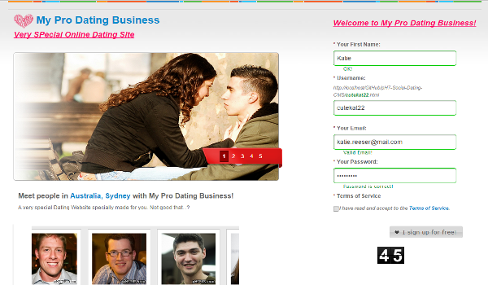

# pH7Builder

Self-hosted, open-source PHP software for building white-label dating sites,
matchmaking communities, and social networks. You keep control of the code,
hosting, database, and member data.

Formerly pH7CMS.

[](https://github.com/pH7Software/pH7-Social-Dating-CMS/actions/workflows/test.yml)
[](https://github.com/pH7Software/pH7-Social-Dating-CMS/actions/workflows/phpstan.yml)
[](https://github.com/pH7Software/pH7-Social-Dating-CMS/actions/workflows/composer.yml)
[](composer.json)
[](LICENSE.md)
[](https://github.com/pH7Software/pH7-Social-Dating-CMS/releases)

**What you need:** PHP 8.2+, MySQL 8.0+, URL rewriting, and a web server.
Composer 2 is needed only for a source checkout; the versioned release ZIP
includes locked production dependencies. With the server ready, allow about
**20–30 minutes** for deployment and the guided browser installer. DNS, TLS
certificate issuance, and mail-provider approval are outside that estimate.

[Quick Start](docs/QUICK_START.md) ·
[Upgrade Guide](docs/UPGRADING.md) ·
[Launch Checklist](docs/LAUNCH_CHECKLIST.md) ·
[Release guides](docs/) ·
[Releases](https://github.com/pH7Software/pH7-Social-Dating-CMS/releases)



## What is included

- Member profiles, search, matchmaking, nearby people, friends, and activity
  streams.
- Private messages, instant chat, notifications, comments, forums, blogs,
  photos, and videos.
- Membership groups, paid plans, advertisements, affiliates, and supported
  payment-gateway integrations.
- Account approval, reporting, moderation queues, registration throttling,
  blocking tools, and optional image screening.
- Multilingual routes and content, translated interface packs, multiple themes,
  an administration panel, and PWA support when served over HTTPS.
- A modular MVC application built on the project-specific pH7Framework and
  PH7Tpl template engine.

Features depend on the modules you enable and the external services you
configure. Before accepting real users or payments, complete the
[Launch Checklist](docs/LAUNCH_CHECKLIST.md) and test the exact production
configuration.

## Requirements

- PHP 8.2 or newer with `curl`, `dom`, `exif`, `fileinfo`, GD with FreeType and
  WebP, `hash`, `iconv`, `json`, `mbstring`, `openssl`, `pdo_mysql`, `simplexml`,
  `xmlwriter`, `xml`, `zip`, and `zlib`.
- MySQL 8.0 or newer with `utf8mb4` support. Older MySQL releases and MariaDB
  are not verified or supported for this release.
- Apache with URL rewriting, or nginx with equivalent routing and protected
  path rules.
- Composer 2 and outbound Internet access when installing from a source
  checkout instead of the versioned release ZIP.
- A server/hosting sendmail transport, or SMTP credentials supplied through
  the server environment as `PH7_MAILER_DSN`. The application does not store
  SMTP credentials in its admin form.
- HTTPS for production.
- FFmpeg only when locally uploaded video processing is enabled.

The browser installer checks the runtime, extensions, writable paths, MySQL
version, and database connection before importing the schema.

## Quick start

### Local evaluation with Docker

This path is for development and evaluation, not a production deployment:

```console
git clone https://github.com/pH7Software/pH7-Social-Dating-CMS.git
cd pH7-Social-Dating-CMS
docker compose up --build -d
docker compose exec php php _install/create-install-token.php
```

Copy the one-time token printed by the second command, then open
<http://localhost:8080> and enter it. In the installer, use database host `db`,
database `ph7builder`, username `ph7builder`, password `ph7builder`, and port
`3306`. The checkout is snapshotted into a Docker volume. To test changed source,
run `docker compose down -v` before `docker compose up --build -d`; this refreshes
the snapshot but permanently deletes the local application and database volumes.

### Production

Use the ready-to-run ZIP attached to a tagged
[release](https://github.com/pH7Software/pH7-Social-Dating-CMS/releases), set
only the required writable paths, configure the web server, and then open
`/_install/`. Generate the required installer access token from the deployed
directory before opening the browser installer.

```console
curl -LO https://github.com/pH7Software/pH7-Social-Dating-CMS/releases/download/v18.6.0/pH7Builder-v18.6.0.zip
curl -LO https://github.com/pH7Software/pH7-Social-Dating-CMS/releases/download/v18.6.0/pH7Builder-v18.6.0.zip.sha256
sha256sum -c pH7Builder-v18.6.0.zip.sha256
unzip pH7Builder-v18.6.0.zip
cd pH7Builder-v18.6.0
```

The complete copy-paste deployment procedure—including database creation,
permissions, nginx/Apache notes, HTTPS, cron, mail, payments, and the first test
signup—is in the [Production Quick Start](docs/QUICK_START.md).

> [!IMPORTANT]
> Never expose `_protected`, `_repository`, `_tests`, `_tools`, `.git`, or
> installer-private directories. The tracked [`nginx.conf`](nginx.conf) shows
> the required production protections; replace its example domain, document
> root, log paths, and PHP-FPM socket for your server.

## From install to launch

After installation, sign in at `/admin123/` and work through these areas:

1. **Branding:** Settings → General, Meta Tags/Homepage Texts, and your theme.
2. **Registration:** Settings → Registration; choose activation and moderation
   rules deliberately.
3. **Memberships:** Billing → Memberships List; verify every limit and price.
4. **Payments:** Billing → Gateways Configuration; begin with test credentials
   and keep unused gateways disabled.
5. **Email:** Settings → Email controls sender details. Configure SMTP through
   `PH7_MAILER_DSN` or provide a server sendmail relay, then test delivery and
   spam placement.
6. **Automation:** Settings → Automation contains the secret used by cron URLs;
   see the exact jobs in the [Quick Start](docs/QUICK_START.md#7-configure-cron).
7. **Go live:** complete the security, legal, moderation, backup, email, and
   payment checks in the [Launch Checklist](docs/LAUNCH_CHECKLIST.md).

## Upgrading

Back up the database and application files before every upgrade. Read the
release notes for version-specific migrations, preserve local configuration,
run the [manual Upgrade Guide](docs/UPGRADING.md), clear application caches,
and test on a staging copy before production. Do not overwrite a live
installation with an unreviewed branch archive.

## Translations

Language packs live in the separate
[pH7 Internationalization repository](https://github.com/pH7Software/pH7-Internationalization).
Keep application code and community translations in their respective
repositories.

## Documentation and support

- [Official website](https://ph7builder.com)
- [Release guides](docs/)
- [Issue tracker](https://github.com/pH7Software/pH7-Social-Dating-CMS/issues)
- [Discussions](https://github.com/pH7Software/pH7-Social-Dating-CMS/discussions)
- [Security policy](SECURITY.md)

Search existing issues before opening a bug report. Use Discussions for setup
questions and ideas. Report vulnerabilities privately as described in
`SECURITY.md`.

## Contributing

Bug fixes, tests, documentation, modules, themes, and translations are welcome.
Please read [CONTRIBUTING.md](CONTRIBUTING.md), keep pull requests focused, and
run the test and static-analysis commands listed there.

## Creator and project

pH7Builder was created by
[Pierre-Henry Soria](https://ph7.me) ([GitHub](https://github.com/pH-7)) and is
maintained in the [pH7Software organization](https://github.com/pH7Software).
If the project helps your business, you can support continued maintenance via
[Ko-fi](https://ko-fi.com/phenry) or
[Buy Me a Coffee](https://www.buymeacoffee.com/ph7cms).

## License

pH7Builder is distributed under the [MIT License](LICENSE.md). See
[COPYRIGHT.md](COPYRIGHT.md) for project and third-party notice guidance.
